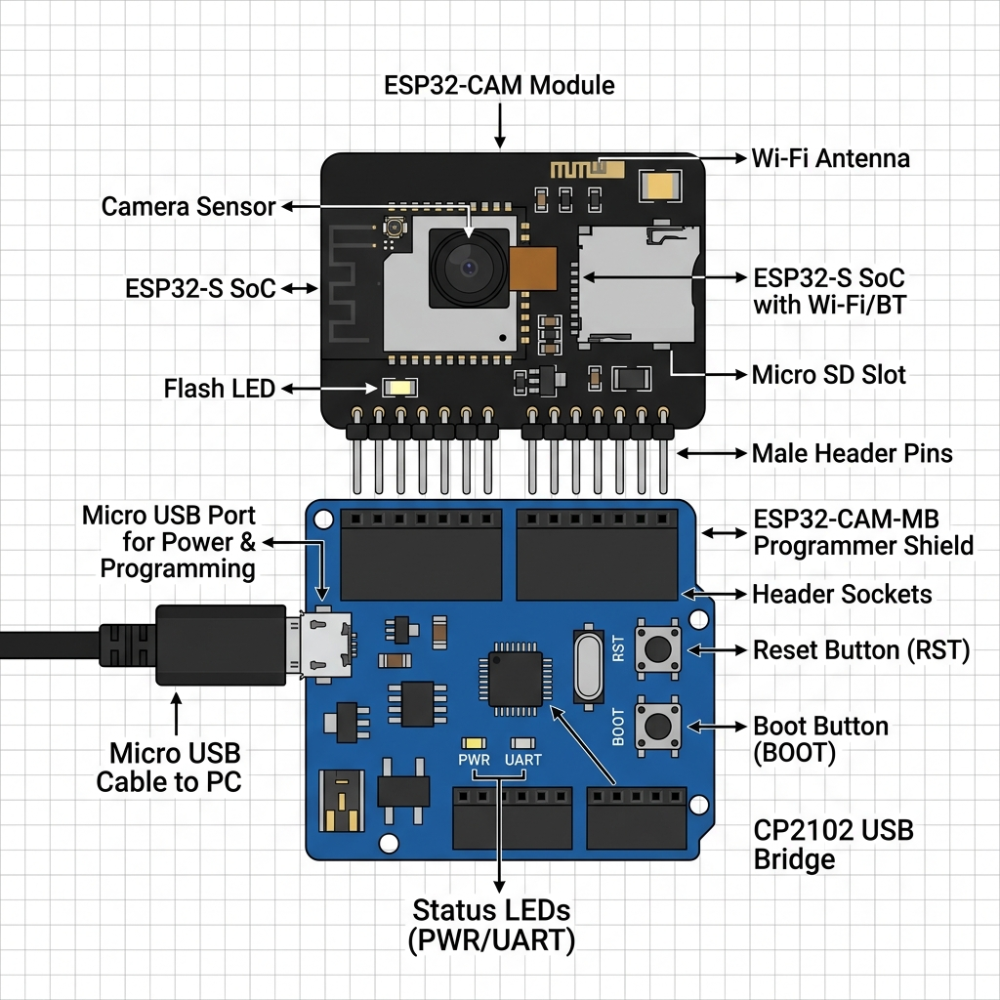
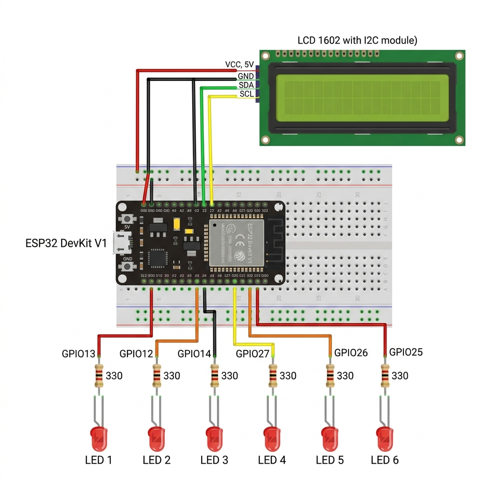
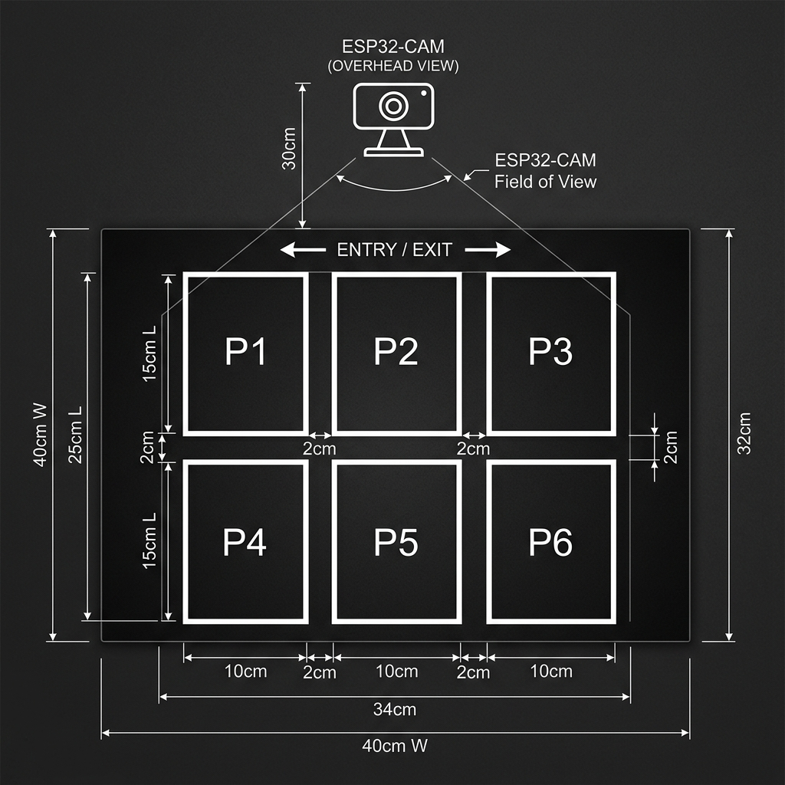

# 🔧 Panduan Lengkap Perakitan & Perancangan Hardware
## Smart Parking System — Garis Awan (AIoT)

Dokumen ini berisi panduan **langkah-demi-langkah** untuk merakit seluruh komponen hardware sistem parkir pintar hingga berhasil beroperasi penuh. Ikuti setiap tahap secara berurutan.

---

## Daftar Isi

1. [Daftar Belanja Komponen](#1-daftar-belanja-komponen)
2. [Tahap A: Pemrograman ESP32-CAM](#tahap-a-pemrograman-esp32-cam)
3. [Tahap B: Perakitan Sirkuit Display (ESP32 DevKit V1)](#tahap-b-perakitan-sirkuit-display)
4. [Tahap C: Pembuatan Maket Parkir 6 Slot](#tahap-c-pembuatan-maket-parkir-6-slot)
5. [Tahap D: Pemasangan Kamera ESP32-CAM](#tahap-d-pemasangan-kamera-esp32-cam)
6. [Tahap E: Pengujian End-to-End](#tahap-e-pengujian-end-to-end)
7. [Troubleshooting](#troubleshooting)

---

## 1. Daftar Belanja Komponen

> [!IMPORTANT]
> Pastikan semua komponen sudah tersedia sebelum memulai perakitan.

### Unit Elektronik Utama

| No | Komponen | Qty | Estimasi Harga | Keterangan |
|:--:|----------|:---:|:--------------:|------------|
| 1 | ESP32 DevKit V1 | 1 | Rp55.000 | Display Controller |
| 2 | ESP32-CAM (OV2640) | 1 | Rp75.000 | Sensor Visual (Kamera) |
| 3 | Shield ESP32-CAM-MB | 1 | Rp25.000 | Programmer Shield USB untuk ESP32-CAM |
| 4 | LCD 1602 + Modul I2C (PCF8574) | 1 | Rp25.000 | Layar informasi |
| 5 | LED Merah 5mm | 6 | Rp3.000 | Indikator slot parkir |
| 6 | Resistor 330Ω (1/4 Watt) | 6 | Rp2.000 | Pembatas arus LED |
| 7 | Breadboard 400 titik | 1 | Rp15.000 | Papan sirkuit sementara |
| 8 | Kabel Jumper Male-Male | 20 pcs | Rp10.000 | Penghubung di breadboard |
| 9 | Kabel Jumper Female-Male | 4 pcs | Rp5.000 | Penghubung LCD I2C |
| 10 | Kabel Micro USB | 2 | Rp15.000 | Power supply / Flashing |

### Material Maket

| No | Komponen | Qty | Estimasi Harga |
|:--:|----------|:---:|:--------------:|
| 12 | Papan MDF/Triplek (40×25 cm) | 1 | Rp30.000 |
| 13 | Cat semprot hitam matte | 1 | Rp25.000 |
| 14 | Lakban putih / stiker vinyl | 1 rol | Rp10.000 |
| 15 | Mobil-mobilan mini (HotWheels) | 6 | Rp50.000 |
| 16 | Tiang penyangga kamera (PVC/tripod mini) | 1 | Rp30.000 |
| 17 | Lem tembak + isi lem | 1 set | Rp15.000 |

> **Total Estimasi: Rp395.000 – Rp450.000**

---

## Tahap A: Pemrograman ESP32-CAM

> [!NOTE]
> ESP32-CAM murni **tidak memiliki port USB bawaan**. Karena Anda menggunakan **ESP32-CAM-MB USB Programmer Shield**, proses *flashing* menjadi sangat praktis, tinggal colok seperti perangkat USB biasa.

### Alat yang Dibutuhkan
- Modul ESP32-CAM beserta ESP32-CAM-MB Shield (Programmer)
- Laptop dengan Arduino IDE terinstall
- Kabel Micro USB (pastikan kabel mendukung transfer data, bukan hanya *charging*)

### Langkah A.1: Menyambungkan ESP32-CAM ke Laptop



Ikuti langkah-langkah berikut untuk perakitan *programmer shield*:

1. **Pasang ESP32-CAM ke Shield Programmer:**
   - Tumpuk papan ESP32-CAM ke pin header pada shield ESP32-CAM-MB.
   - Pastikan arahnya pas: **Lensa kamera / antena** harus searah dengan port Micro USB di shield bagian bawah.
2. **Hubungkan ke Laptop:**
   - Colokkan kabel Micro-USB ke port yang ada di *shield*, lalu hubungkan ujung lainnya ke port USB laptop Anda.
   - Shield ini sudah memiliki chip USB-to-Serial terintegrasi (seperti CH340), sehingga tidak perlu merangkai kabel jumper sama sekali.

### Langkah A.2: Setup Arduino IDE

1. **Buka Arduino IDE** (versi 1.8.x atau 2.x)

2. **Tambahkan Board ESP32:**
   - Buka `File → Preferences`
   - Pada kolom *Additional Board Manager URLs*, tambahkan:
     ```
     https://raw.githubusercontent.com/espressif/arduino-esp32/gh-pages/package_esp32_index.json
     ```
   - Buka `Tools → Board → Boards Manager`
   - Cari **"esp32"** oleh Espressif Systems → klik **Install**

3. **Pilih Board:**
   - `Tools → Board → ESP32 Arduino → AI Thinker ESP32-CAM`

4. **Pilih Port:**
   - `Tools → Port → COMx` (pilih port COM USB yang muncul saat *shield* dihubungkan ke laptop)

5. **Atur Upload Speed:**
   - `Tools → Upload Speed → 115200`

### Langkah A.3: Upload Kode Kamera (CameraWebServer)

1. Buka contoh kode bawaan:
   - `File → Examples → ESP32 → Camera → CameraWebServer`

2. **Edit konfigurasi Wi-Fi** di bagian atas kode:
   ```cpp
   // Ganti dengan SSID dan password Wi-Fi Anda
   const char* ssid = "Nama_WiFi_Anda";
   const char* password = "Password_WiFi_Anda";
   ```

3. **Pastikan model kamera** sudah benar:
   ```cpp
   #define CAMERA_MODEL_AI_THINKER  // Uncomment baris ini
   // Comment semua model kamera lainnya
   ```

4. **Upload kode:**
   - Klik tombol **Upload (→)** di Arduino IDE.
   - Tunggu hingga proses upload selesai (100% / `Leaving... Hard resetting via RTS pin...`).
   - *Catatan:* Shield ESP32-CAM-MB mendukung *auto-flash*. Jika upload tertahan/stuck di `Connecting...`, berarti laptop tidak otomatis mereset ESP. Solusinya: tekan dan tahan tombol **IO0** pada shield, lalu tekan tombol **RST** sebentar, kemudian lepaskan tombol **IO0**, dan proses upload akan berjalan.

5. **Setelah upload berhasil:**
   - Proses pemrograman selesai!
   - Buka **Serial Monitor** (`Tools → Serial Monitor`, baud rate `115200`)
   - Tekan tombol **RESET** di ESP32-CAM atau shield.
   - ESP32-CAM akan menampilkan **IP Address**-nya, contoh:
     ```
     WiFi connected
     Camera Ready! Use 'http://192.168.1.100' to connect
     ```
   - **Catat IP ini** — Anda akan membutuhkannya nanti

6. **Verifikasi kamera:**
   - Buka browser di laptop, akses: `http://<IP_ESP32CAM>`
   - Halaman web kamera akan muncul
   - Klik **Start Stream** untuk melihat preview video
   - URL stream yang digunakan oleh AI Server: `http://<IP_ESP32CAM>:81/stream`

> [!TIP]
> Jika gagal terkoneksi Wi-Fi, pastikan ESP32-CAM dan laptop berada di **jaringan Wi-Fi yang sama** (2.4 GHz, bukan 5 GHz).

### ✅ Checkpoint A: ESP32-CAM Berhasil Jika:
- [x] Kode ter-upload tanpa error
- [x] Serial Monitor menampilkan IP address
- [x] Browser dapat menampilkan video stream dari kamera
- [x] URL `http://<IP>:81/stream` dapat diakses

---

## Tahap B: Perakitan Sirkuit Display

### Alat yang Dibutuhkan
- ESP32 DevKit V1
- Breadboard 400 titik
- LCD 1602 + Modul I2C
- 6× LED Merah 5mm
- 6× Resistor 330Ω
- Kabel jumper Male-Male (~20 buah)
- Kabel jumper Female-Male (4 buah)

### Diagram Wiring Lengkap



### Langkah B.1: Pasang ESP32 di Breadboard

```
          ┌─────────────────────────────────┐
          │     BREADBOARD (400 titik)      │
          │                                 │
  [+] ════╪═════════════════════════════════╪════ [+]  ← Rel Power (MERAH)
  [-] ════╪═════════════════════════════════╪════ [-]  ← Rel Ground (BIRU)
          │                                 │
          │    ┌──────────────────┐         │
          │    │  ESP32 DevKit V1 │         │
          │    │                  │         │
          │    │ 3V3    ┃    VIN  │──→ [+]  │  ← Kabel merah ke rel power
          │    │ GND    ┃    GND  │──→ [-]  │  ← Kabel hitam ke rel ground
          │    │ D13    ┃    D12  │         │
          │    │ D14    ┃    D27  │         │
          │    │ D26    ┃    D25  │         │
          │    │ D21    ┃    D22  │         │
          │    │  ...   ┃   ...   │         │
          │    └──────────────────┘         │
          └─────────────────────────────────┘
```

1. **Posisikan ESP32** di tengah breadboard, melintasi celah tengah (*center divider*)
2. Pastikan setiap pin ESP32 masuk ke lubang breadboard yang berbeda baris
3. Hubungkan pin **VIN** ke rel power (+) breadboard → kabel **MERAH**
4. Hubungkan pin **GND** ke rel ground (-) breadboard → kabel **HITAM**

### Langkah B.2: Pasang 6 LED + Resistor

> [!IMPORTANT]
> LED memiliki polaritas! **Kaki panjang = Anoda (+)**, **Kaki pendek = Katoda (-)**. Jika terbalik, LED tidak akan menyala.

Untuk **setiap** LED (ulangi 6 kali):

```
  Pin GPIO ESP32 ──→ [Kabel Jumper] ──→ Anoda LED (+, kaki panjang)
                                        │
                                    Katoda LED (-, kaki pendek)
                                        │
                                    [Resistor 330Ω]
                                        │
                                    Rel GND [-] Breadboard
```

**Tabel Koneksi LED:**

| LED | Kaki Anoda (+) → Pin ESP32 | Kaki Katoda (-) → Resistor → GND | Warna Kabel |
|:---:|:--------------------------:|:--------------------------------:|:-----------:|
| Slot 1 | **GPIO 13** | Resistor 330Ω → Rel GND | Orange |
| Slot 2 | **GPIO 12** | Resistor 330Ω → Rel GND | Orange |
| Slot 3 | **GPIO 14** | Resistor 330Ω → Rel GND | Orange |
| Slot 4 | **GPIO 27** | Resistor 330Ω → Rel GND | Biru |
| Slot 5 | **GPIO 26** | Resistor 330Ω → Rel GND | Biru |
| Slot 6 | **GPIO 25** | Resistor 330Ω → Rel GND | Biru |

**Langkah detail per LED:**

1. Tancapkan **LED** di breadboard — kaki panjang (+) di satu baris, kaki pendek (-) di baris sebelahnya
2. Tancapkan **Resistor 330Ω** — satu kaki di baris yang sama dengan katoda LED, kaki lainnya di baris yang terhubung ke rel GND
3. Pasang **kabel jumper** dari baris anoda LED ke pin GPIO ESP32 yang sesuai
4. Pastikan resistor terhubung ke **rel GND (-)** breadboard

```
  Contoh pemasangan LED Slot 1 di breadboard:
  
  Baris 5:  [Kabel dari GPIO 13] ── [Anoda LED (+)]
  Baris 6:  [Katoda LED (-)] ── [Resistor 330Ω kaki 1]
  Baris 7:  [Resistor 330Ω kaki 2] ── [Kabel ke rel GND]
```

### Langkah B.3: Pasang LCD 1602 I2C

LCD menggunakan kabel **Female-to-Male** karena modul I2C memiliki pin header (lubang):

```
┌────────────────────┐
│   LCD 1602 I2C     │
│   (Modul PCF8574)  │
│                    │
│  VCC ─── F-M ──── VIN (5V) ESP32     (Kabel MERAH)
│  GND ─── F-M ──── GND ESP32          (Kabel HITAM)
│  SDA ─── F-M ──── GPIO 21 ESP32      (Kabel HIJAU)
│  SCL ─── F-M ──── GPIO 22 ESP32      (Kabel KUNING)
│                    │
│  ⚙️ Potensiometer ─── Putar untuk atur kontras teks
└────────────────────┘
```

**Langkah:**
1. Colokkan ujung **Female** kabel ke 4 pin modul I2C (VCC, GND, SDA, SCL)
2. Tancapkan ujung **Male** kabel ke baris yang sama dengan pin ESP32 di breadboard:
   - **VCC → VIN** (atau rel power +)
   - **GND → GND** (atau rel ground -)
   - **SDA → GPIO 21**
   - **SCL → GPIO 22**

> [!TIP]
> Jika LCD menyala tapi tidak menampilkan teks, **putar potensiometer biru kecil** di belakang modul I2C menggunakan obeng kecil hingga teks terlihat jelas.

### Langkah B.4: Upload Firmware ke ESP32 DevKit V1

1. Hubungkan ESP32 DevKit V1 ke laptop via **kabel Micro USB**
2. Buka **Arduino IDE**
3. Pilih Board: `Tools → Board → ESP32 Dev Module`
4. Pilih Port: `Tools → Port → COMx`
5. Buka file [sketch.ino](file:///d:/portofolio/kelompok_iot/esp32_firmware/sketch.ino)
6. **Edit kredensial Wi-Fi:**
   ```cpp
   const char* ssid = "Nama_WiFi_Anda";
   const char* password = "Password_WiFi_Anda";
   ```
7. Klik **Upload (→)**
8. Setelah berhasil, buka Serial Monitor (115200 baud)

### ✅ Checkpoint B: Sirkuit Display Berhasil Jika:

- [x] LCD menyala dan menampilkan teks "Smart Parking" → "WiFi Connected!" → IP Address
- [x] Serial Monitor menunjukkan "Terhubung ke MQTT Broker"
- [x] LED menampilkan animasi startup (menyala berurutan lalu mati)
- [x] LCD menampilkan "MQTT Connected! / Menunggu data..."
- [x] Semua 6 LED dalam kondisi mati (menunggu data)

**Jika ada yang gagal, lihat bagian [Troubleshooting](#troubleshooting).**

---

## Tahap C: Pembuatan Maket Parkir 6 Slot

### Layout Maket (Top-Down View)



### Langkah C.1: Persiapan Papan Alas

1. **Potong papan MDF/triplek** dengan ukuran **40 cm × 25 cm**
2. **Amplas** permukaan hingga halus
3. **Cat** seluruh permukaan atas dengan **cat semprot hitam matte**
4. Biarkan kering sempurna (**minimal 2 jam**)
5. Pastikan permukaan gelap dan polos — ini penting untuk kontras deteksi kamera

### Langkah C.2: Buat Garis Parkir (6 Slot)

Gunakan **lakban putih** atau **stiker vinyl putih** (lebar 3-5 mm) untuk membuat garis:

```
      ← 40 cm total →
  ┌──────────────────────────────────────┐  ↑
  │  ┌────┐  ┌────┐  ┌────┐            │  │
  │  │ P1 │  │ P2 │  │ P3 │   ← Baris  │  │
  │  │    │  │    │  │    │     Atas    │  │
  │  │10cm│  │10cm│  │10cm│            │  │
  │  │ ×  │  │ ×  │  │ ×  │            │  │
  │  │15cm│  │15cm│  │15cm│            │  25 cm
  │  └────┘  └────┘  └────┘            │  │
  │   2cm      2cm                      │  │
  │  ┌────┐  ┌────┐  ┌────┐            │  │
  │  │ P4 │  │ P5 │  │ P6 │   ← Baris  │  │
  │  │    │  │    │  │    │     Bawah   │  │
  │  │10cm│  │10cm│  │10cm│            │  │
  │  │ ×  │  │ ×  │  │ ×  │            │  │
  │  │15cm│  │15cm│  │15cm│            │  │
  │  └────┘  └────┘  └────┘            │  ↓
  └──────────────────────────────────────┘
       ↑  Masuk / Keluar
```

**Petunjuk pembuatan:**

1. **Ukur dan tandai** posisi setiap slot menggunakan penggaris dan pensil tipis
2. **Tempel lakban putih** mengikuti garis yang sudah ditandai
3. Setiap slot berukuran **10 cm (lebar) × 15 cm (panjang)**
4. Jarak antar slot: **2 cm**
5. Margin dari tepi papan: **~3 cm** di setiap sisi
6. Pastikan **garis putih terlihat sangat jelas** kontras dengan lantai hitam

> [!IMPORTANT]
> Kejelasan garis putih adalah kunci deteksi otomatis! Garis yang kabur atau terputus akan menyulitkan kalibrasi.

### Langkah C.3: Siapkan Objek Deteksi

- Gunakan **6 mobil-mobilan mini** (HotWheels/Matchbox)
- Pilih warna yang **kontras** dengan lantai hitam (putih, merah, kuning, biru)
- Pastikan ukuran mobil **cukup memenuhi** area slot (minimal 60% terisi)

### ✅ Checkpoint C: Maket Berhasil Jika:
- [x] Papan alas berwarna hitam merata dan polos
- [x] 6 kotak parkir terlihat jelas dengan garis putih
- [x] Mobil-mobilan pas masuk ke dalam kotak
- [x] Layout simetris 2×3

---

## Tahap D: Pemasangan Kamera ESP32-CAM

### Langkah D.1: Buat Dudukan Kamera

**Opsi 1 — Tiang PVC (Direkomendasikan):**
```
        [ESP32-CAM]  ← Mengarah ke bawah (top-down)
            │
       ┌────┴────┐
       │ Bracket  │  ← Lem tembak / karet gelang
       └────┬────┘
            │
     ┌──────┴──────┐
     │  Pipa PVC   │  ← Tinggi 30-40 cm
     │  (diameter  │
     │   20mm)     │
     └──────┬──────┘
            │
     ┌──────┴──────┐
     │    Base     │  ← Papan kecil / dilem ke maket
     └─────────────┘
```

- Potong pipa PVC **∅20mm** sepanjang **30-40 cm**
- Pasang **siku PVC** di atas untuk mengarahkan kamera ke bawah
- Tempelkan base ke **salah satu sisi maket** menggunakan lem tembak
- Pasang ESP32-CAM pada bracket atas menggunakan lem tembak / karet gelang

**Opsi 2 — Tripod Mini:**
- Gunakan tripod HP mini
- Letakkan di samping maket
- Arahkan kamera ke bawah tegak lurus

### Langkah D.2: Atur Sudut Kamera

> [!IMPORTANT]
> Kamera HARUS menghadap **tegak lurus ke bawah** (*top-down view*). Ini kritis untuk akurasi deteksi ROI.

```
   Sudut BENAR ✅          Sudut SALAH ❌
   
   [CAM]                   [CAM]
     │                        \
     │  (90°)                  \  (sudut miring)
     ▼                          \
  ┌──────┐                   ┌──────┐
  │Maket │                   │Maket │
  └──────┘                   └──────┘
```

**Tips posisi kamera:**
- Tinggi ideal: **30-40 cm** di atas maket
- Kamera harus bisa melihat **seluruh 6 slot** dalam satu frame
- Pastikan pencahayaan merata — hindari bayangan tajam
- Setelah posisi kamera fix, **jangan geser lagi**

### Langkah D.3: Power Supply ESP32-CAM

- ESP32-CAM membutuhkan daya **5V**
- Opsi 1: Hubungkan via **kabel USB** ke power bank / charger HP
- Opsi 2: Hubungkan pin 5V dan GND ke power supply breadboard
- Pastikan daya stabil — daya kurang akan membuat kamera hang

### ✅ Checkpoint D: Kamera Berhasil Jika:
- [x] ESP32-CAM terpasang stabil di atas maket
- [x] Kamera menghadap tegak lurus ke bawah
- [x] Seluruh 6 slot terlihat dalam frame kamera
- [x] Stream video bisa diakses di browser: `http://<IP>:81/stream`
- [x] Pencahayaan merata tanpa bayangan gelap

---

## Tahap E: Pengujian End-to-End

Ini adalah tahap final untuk memastikan seluruh sistem terintegrasi sempurna.

### Langkah E.1: Checklist Koneksi

Pastikan semua perangkat sudah:

```
┌──────────────┐     ┌──────────────┐     ┌──────────────┐
│  ESP32-CAM   │     │    Laptop    │     │ ESP32 DevKit │
│  (Kamera)    │     │ (AI Server)  │     │  (Display)   │
│              │     │              │     │              │
│ WiFi: ✅     │     │ WiFi: ✅     │     │ WiFi: ✅     │
│ Stream: ✅   │     │ Python: ✅   │     │ MQTT: ✅     │
│ Power: ✅    │     │ OpenCV: ✅   │     │ LCD: ✅      │
└──────────────┘     └──────────────┘     └──────────────┘
       │                    │                    │
       └────────── Jaringan WiFi yang SAMA ──────┘
```

### Langkah E.2: Jalankan Sistem

**Urutan menjalankan (PENTING — ikuti urutan ini):**

1. **Nyalakan ESP32-CAM** → Tunggu sampai terkoneksi WiFi
2. **Nyalakan ESP32 DevKit V1** → Tunggu sampai LCD tampil "MQTT Connected!"
3. **Jalankan AI Server** di laptop:
   ```bash
   cd ai_server
   python main_requests.py
   ```
4. **Jalankan Web Dashboard** di laptop:
   ```bash
   cd web_dashboard
   npm run dev
   ```
5. **Buka browser**: `http://localhost:3000`

### Langkah E.3: Kalibrasi Awal

Saat pertama kali `main_requests.py` dijalankan:

1. Layar OpenCV akan menampilkan **"Mencari Slot: X/6 Terdeteksi"**
2. Sistem akan otomatis mendeteksi 6 kotak parkir dari garis putih
3. Kotak yang terdeteksi ditandai dengan **garis kuning**
4. Setelah ≥3 slot terdeteksi → **"LOCKED"** (deteksi okupansi dimulai)

**Jika slot tidak terdeteksi:**
- Perbaiki **pencahayaan** — terlalu gelap/terang bisa gagal
- Pastikan **garis putih** terlihat tajam dari atas
- Tekan **`r`** untuk reset kalibrasi dan mencoba ulang
- Atur `PIXEL_THRESHOLD` di kode jika perlu

### Langkah E.4: Uji Coba Parkir

1. **Letakkan 1 mobil-mobilan** di Slot P1
2. **Verifikasi reaksi berantai:**

| Komponen | Reaksi yang Diharapkan | ⏱ Waktu |
|----------|----------------------|---------|
| Layar OpenCV (laptop) | Kotak P1 berubah dari HIJAU → **MERAH** | < 1 detik |
| Serial Monitor (MQTT) | `📤 Data terkirim: 5/6 tersedia` | < 1 detik |
| LCD 1602 | `Kosong:5/6 slot` + `1X 2O 3O 4O 5O 6O` | < 2 detik |
| LED Slot 1 (GPIO 13) | **Menyala** 🔴 | < 2 detik |
| Web Dashboard | Slot 1 card berubah merah + "TERISI" | < 2 detik |
| Parking Map | Muncul 🚗 di P1 | < 2 detik |

3. **Angkat mobil** dari Slot P1 → semua kembali ke status KOSONG
4. **Ulangi** untuk semua 6 slot satu per satu
5. **Uji beban penuh**: letakkan mobil di semua 6 slot sekaligus
   - LCD: `Kosong:0/6 slot`
   - Dashboard: `0/6 Slot Tersedia`, okupansi `100%`
   - Semua 6 LED menyala

### Langkah E.5: Uji Halaman Analytics

1. Biarkan sistem berjalan selama **5-10 menit** sambil menaruh/mengangkat mobil
2. Buka `http://localhost:3000/analytics`
3. Verifikasi chart menampilkan data:
   - **Peak Hours**: grafik garis menunjukkan rata-rata okupansi
   - **Slot Preference**: bar chart menunjukkan slot mana yang paling sering terisi
   - **Timeline**: area chart menunjukkan perubahan real-time
   - **Durasi**: tabel menunjukkan estimasi lama parkir

### ✅ Checkpoint E: Sistem End-to-End Berhasil Jika:
- [x] Meletakkan mobil → LED menyala + LCD update + Dashboard berubah merah
- [x] Mengangkat mobil → LED mati + LCD update + Dashboard berubah hijau
- [x] Semua 6 slot responsif (< 2 detik delay)
- [x] Analytics menampilkan chart dengan data
- [x] Tidak ada error di Serial Monitor atau console browser

---

## Troubleshooting

### ❌ ESP32-CAM Tidak Bisa Di-flash

| Gejala | Penyebab | Solusi |
|--------|---------|-------|
| `Failed to connect to ESP32` | IO0 tidak terhubung ke GND | Pasang jumper IO0-GND, tekan RESET |
| `A fatal error occurred` | Koneksi kabel longgar | Cek semua 5 kabel F-F, pastikan kencang |
| Port COM tidak muncul | Driver FTDI belum terinstall | Download & install driver CH340/CP2102 |
| Upload stuck di `Connecting...` | Timing reset salah | Tekan RESET tepat saat muncul `Connecting...` |

### ❌ LCD Menyala Tapi Tidak Ada Teks

| Gejala | Penyebab | Solusi |
|--------|---------|-------|
| Backlight ON, layar kosong | Kontras terlalu rendah | **Putar potensiometer** di belakang modul I2C |
| Karakter acak/kotak | Alamat I2C salah | Jalankan I2C Scanner, alamat mungkin `0x3F` bukan `0x27` |
| Tidak menyala sama sekali | Koneksi power salah | Pastikan VCC→5V dan GND→GND benar |

### ❌ LED Tidak Menyala

| Gejala | Penyebab | Solusi |
|--------|---------|-------|
| Tidak menyala sama sekali | LED terbalik | Tukar posisi kaki — panjang (+) ke GPIO |
| Tetap menyala terus | Tanpa resistor | Pasang resistor 330Ω di jalur katoda |
| Menyala redup | Resistor terlalu besar | Gunakan resistor 220Ω atau 330Ω |
| Beberapa LED mati | Pin GPIO salah | Cek tabel pinout, pastikan pin benar |

### ❌ MQTT Tidak Terkoneksi

| Gejala | Penyebab | Solusi |
|--------|---------|-------|
| `MQTT Error` di LCD | WiFi belum konek | Pastikan SSID/password benar |
| Gagal terus reconnect | Broker down | Coba `test.mosquitto.org` sebagai alternatif |
| Data tidak sampai | Topik MQTT berbeda | Pastikan topik sama persis di Python dan ESP32 |

### ❌ Deteksi Slot Tidak Akurat

| Gejala | Penyebab | Solusi |
|--------|---------|-------|
| Slot selalu merah (terisi) | Threshold terlalu rendah | Naikkan `PIXEL_THRESHOLD` ke 8000-10000 |
| Slot selalu hijau (kosong) | Threshold terlalu tinggi | Turunkan `PIXEL_THRESHOLD` ke 3000-4000 |
| Slot terdeteksi < 6 | Garis putih tidak jelas | Perjelas garis dengan lakban baru |
| Kotak ROI bergeser | Kamera bergerak | Stabilkan kamera, tekan `r` untuk rekalibrasi |

---

## Diagram Alir Data Lengkap

```
┌─────────────┐
│  ESP32-CAM  │  ← Streaming video MJPEG via WiFi
│   OV2640    │
└──────┬──────┘
       │  http://<IP>:81/stream
       ▼
┌──────────────────────────────────┐
│  LAPTOP / EDGE SERVER           │
│                                  │
│  Python + OpenCV                 │
│  ┌─ Ambil frame dari stream     │
│  ├─ Cari ROI (6 kotak parkir)   │
│  ├─ Adaptive Thresholding       │
│  ├─ countNonZero() per ROI      │
│  ├─ Bandingkan PIXEL_THRESHOLD  │
│  └─ Tentukan: KOSONG / TERISI   │
│                                  │
│  Output: JSON Payload            │
│  {slot_1:0, slot_2:1, ...}      │
└──────┬───────────────────────────┘
       │  MQTT Publish
       │  Topic: kelompok_iot/parking/status
       │  Topic: garisawan/parking/display
       ▼
┌──────────────────┐
│  HiveMQ Broker   │  ← Cloud MQTT (gratis)
│  broker.hivemq   │
└──┬──────────┬────┘
   │          │
   ▼          ▼
┌────────┐  ┌──────────────────┐
│ ESP32  │  │  WEB DASHBOARD   │
│DevKit  │  │  Next.js (React) │
│        │  │                  │
│ 6 LED  │  │  mqtt.js (WSS)   │
│ LCD    │  │  6 Slot Cards    │
│ I2C    │  │  Parking Map     │
│        │  │  Analytics       │
└────────┘  └──────────────────┘
```

---

> [!TIP]
> **Tips Presentasi Demo:**
> 1. Siapkan **skenario demo** yang jelas: mulai dari semua slot kosong, isi satu-satu, lalu kosongkan
> 2. Tunjukkan **reaksi berantai**: fisik → OpenCV → MQTT → LED/LCD → Dashboard
> 3. Buka halaman **Analytics** untuk menunjukkan insight data
> 4. Siapkan **backup power** (power bank) untuk semua ESP32
> 5. **Test semua koneksi** minimal 30 menit sebelum demo dimulai
